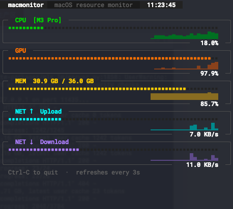

# macmonitor

A lightweight, macOS system (Mac silicon M-Series) resource monitor for the terminal.



```
  macmonitor   macOS resource monitor   11:02:33

╭─ CPU  [M3 Pro] ──────────────────────────────────────── 15.6% ─╮
│ ■■■■■■■■■■■■■■■■■■■■■■■■■■■■■■■■■■■■■■■■■■■■■■■■■■■■■■■■■■■■■■■■■■■■■■■ │
│ ▁▂▁▁▂▃▁▂▁▁▂▃▄▃▂▁▂▁▁▂▃▁▂▁▁▂▃▄▃▂▁▂▁▁▂▃▁▂▁▁▂▃▄▃▂▁▂▁▁▂▃▁▂▁ │
╰──────────────────────────────────────────────────────────────────╯
╭─ GPU ────────────────────────────────────────────────── 11.3% ─╮
│ ■■■■■■■■■■■■■■■■■■■■■■■■■■■■■■■■■■■■■■■■■■■■■■■■■■■■■■■■■■■■■■■■■■■■■■ │
│ ▁▁▂▁▁▁▁▁▂▁▁▁▁▁▂▁▁▁▁▁▂▁▁▁▁▁▂▁▁▁▁▁▂▁▁▁▁▁▂▁▁▁▁▁▂▁▁▁▁▁▂▁▁ │
╰──────────────────────────────────────────────────────────────────╯
╭─ MEM  29.5 GB / 36.0 GB ─────────────────────────────── 82.0% ─╮
│ ■■■■■■■■■■■■■■■■■■■■■■■■■■■■■■■■■■■■■■■■■■■■■■■■■■■■■■■■■■■■■■■■■■■■■■ │
│ ▃▃▃▃▃▃▃▃▃▃▃▃▃▃▃▃▃▃▃▃▃▃▃▃▃▃▃▃▃▃▃▃▃▃▃▃▃▃▃▃▃▃▃▃▃▃▃▃▃▃▃▃▃▃ │
╰──────────────────────────────────────────────────────────────────╯
╭─ NET ↑  Upload ──────────────────────────────────── 682.3 B /s ─╮
│ ■■■■■■■■■■■■■■■■■■■■■■■■■■■■■■■■■■■■■■■■■■■■■■■■■■■■■■■■■■■■■■■■■■■■■■ │
│ ▁▁▂▃▄▅▆▇▇▆▅▄▃▂▁▁▂▃▄▅▆▇▇▆▅▄▃▂▁▁▂▃▄▅▆▇▇▆▅▄▃▂▁▁▂▃▄▅▆▇▇▆▅ │
╰──────────────────────────────────────────────────────────────────╯
╭─ NET ↓  Download ────────────────────────────────── 682.3 B /s ─╮
│ ■■■■■■■■■■■■■■■■■■■■■■■■■■■■■■■■■■■■■■■■■■■■■■■■■■■■■■■■■■■■■■■■■■■■■■ │
│ ▁▂▃▄▅▆▇▇▆▅▄▃▂▁▁▂▃▄▅▆▇▇▆▅▄▃▂▁▁▂▃▄▅▆▇▇▆▅▄▃▂▁▁▂▃▄▅▆▇▇▆▅▄ │
╰──────────────────────────────────────────────────────────────────╯
  Ctrl-C to quit  ·  refreshes every 3s
```

## Features

- **CPU** — overall usage % with chip model name (e.g. M3 Pro)
- **GPU** — hardware active residency % via `powermetrics` (requires sudo)
- **Memory** — used / total in GB; percentage based on `total − available` (includes compressed memory, consistent with macOS Activity Monitor)
- **Network Upload / Download** — live bytes/s, auto-scales to the peak seen in the rolling history window
- **Gradient dot bars** — each bar uses `■` characters with a bright leading edge
- **Sparkline history** — 80-sample rolling chart below every bar
- Refreshes every **3 seconds**; runs in full-screen terminal mode

## Requirements

- macOS (Apple Silicon recommended; Intel supported)
- Python 3.10+

```
pip install rich psutil
```

## Usage

```bash
# CPU · Memory · Network  (no special permissions needed)
python3 macmonitor.py

# + GPU  (requires sudo for powermetrics)
sudo python3 macmonitor.py
```

Press `Ctrl-C` to quit.

### Why sudo for GPU?

GPU utilisation is read from Apple's `powermetrics` tool, which requires root access. Without sudo, the GPU panel shows `N/A (needs sudo)` and everything else works normally.

To avoid typing your password repeatedly you can pre-cache sudo credentials in a separate terminal:

```bash
sudo -v        # caches credentials for ~5 minutes (default)
```

Then run `python3 macmonitor.py` without sudo — it will use `sudo -n` (non-interactive) while credentials are still cached.

## How it works

| Component | Source | Notes |
|-----------|--------|-------|
| `PowerMetrics` | `sudo powermetrics --samplers gpu_power` | Background thread; parses GPU HW active residency from stdout |
| `Monitor` | `psutil` | Collects CPU %, memory, and net I/O on each 3 s tick |
| `dot_bar()` | rendering | Builds a `rich.Text` of `■` characters; first 35 % at normal brightness, last 65 % bold (bright tip) |
| `sparkline()` | rendering | Maps the last 80 values to `▁▂▃▄▅▆▇█` scaled to the rolling max |
| `build_screen()` | rendering | Composes all panels into a `rich.Group` rendered via `rich.Live` |

### Memory percentage

macOS memory is reported differently from Linux. `psutil.virtual_memory().used` only counts **active + wired** pages; the `percent` field uses `(total − available) / total`, which also includes **cached/inactive** and **compressed** pages. macmonitor uses `total − available` for both the GB label and the percentage so the two numbers are always consistent and match Activity Monitor.

### Network scaling

There is no theoretical maximum for network throughput, so the progress bar scales **relative to the highest value seen** in the 80-sample history window. The sparkline uses the same scale. The raw bytes/s value is always shown as the subtitle.

## Configuration

Edit `config.json` in the project directory — no Python knowledge required.
Changes take effect on the next run.

```json
{
  "interval": 3.0,
  "history":  80,
  "dot":      "■",

  "colors": {
    "cpu":       "green3",
    "gpu":       "dark_orange",
    "mem":       "gold1",
    "up":        "cyan1",
    "dn":        "medium_purple1",
    "border":    "grey35",
    "dot_empty": "grey15"
  }
}
```

| Key | Type | Default | Description |
|-----|------|---------|-------------|
| `interval` | float | `3.0` | Seconds between refreshes (minimum `0.5`) |
| `history` | int | `80` | Chart points kept per metric (~4 min at 3 s) |
| `dot` | string | `"■"` | Bar character — try `"●"`, `"▪"`, `"•"` |
| `colors.*` | string | — | [Rich colour name](https://rich.readthedocs.io/en/latest/appendix/colors.html) for each metric |

If `config.json` is missing or contains a parse error, the built-in defaults are used and an error is printed to stderr.

## File layout

```
macmonitor.py        — single-file script, no package structure needed
config.json          — user configuration (interval, history, colors, dot char)
requirements.txt
README.md
assets/
  screenshot.png     — terminal screenshot shown above
```

## License

MIT
