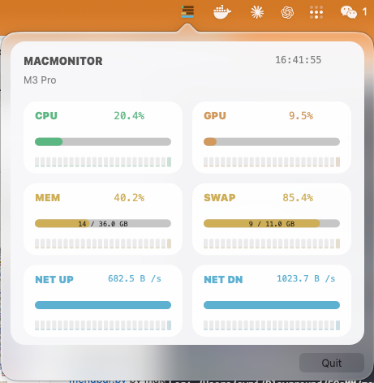

# macmonitor

A lightweight macOS system resource monitor for Apple Silicon Macs, with two ways to run it:

- `CLI mode`: a full terminal dashboard for CPU, GPU, memory, swap, and network activity
- `Menubar mode`: a compact macOS status bar app that shows live CPU, GPU, and network activity

The project includes shell scripts in [`run.sh`](/Users/cyni/Playground/ECsMM/run.sh) so you can start either mode quickly.


## Quick Start

### Install dependencies

- CLI mode needs `rich` and `psutil`
- Menubar mode also needs `pyobjc-framework-Cocoa`

```bash
pip install -r requirements.txt
```

Or install manually:

```bash
pip install rich psutil pyobjc-framework-Cocoa
```

### Use the shell script

[`run.sh`](/Users/cyni/Playground/ECsMM/run.sh) is the main entry point:

```bash
./run.sh start_cli
./run.sh start_menubar
./run.sh stop_menubar
./run.sh restart_menubar
./run.sh status_menubar
./run.sh logs_menubar
```

Default behavior:

- `./run.sh` starts `menubar.py`
- the script requests `sudo` so GPU usage can be collected via `powermetrics`

## Two Modes

### CLI mode

CLI mode runs [`macmonitor.py`](/Users/cyni/Playground/ECsMM/macmonitor.py) in the current terminal and shows:

- CPU usage with chip name
- GPU usage
- memory usage
- swap usage
- network upload and download
- rolling history bars for each metric

Run it with the shell script:

```bash
./run.sh start_cli
```

Or run the Python script directly:

```bash
python3 macmonitor.py
sudo python3 macmonitor.py
```

Notes:

- `sudo` is recommended if you want GPU metrics
- without `sudo`, CPU, memory, swap, and network still work
- quit with `Ctrl-C`

```
  macmonitor   macOS resource monitor   11:02:33

╭─ CPU  [M3 Pro] ──────────────────────────────────────── 15.6% ─╮
│ ■■■■■■■■■■■■■■■■■■■■■■■■■■■■■■■■■■■■■■■■■■■■■■■■■■■■■■■■■■■■■■■■■■■■■■■ │
│ ▁▂▁▁▂▃▁▂▁▁▂▃▄▃▂▁▂▁▁▂▃▁▂▁▁▂▃▄▃▂▁▂▁▁▂▃▁▂▁▁▂▃▄▃▂▁▂▁▁▂▃▁▂▁ │
╰──────────────────────────────────────────────────────────────────╯
╭─ GPU ────────────────────────────────────────────────── 11.3% ─╮
│ ■■■■■■■■■■■■■■■■■■■■■■■■■■■■■■■■■■■■■■■■■■■■■■■■■■■■■■■■■■■■■■■■■■■■■■ │
│ ▁▁▂▁▁▁▁▁▂▁▁▁▁▁▂▁▁▁▁▁▂▁▁▁▁▁▂▁▁▁▁▁▂▁▁▁▁▁▂▁▁▁▁▁▂▁▁▁▁▁▂▁▁ │
╰──────────────────────────────────────────────────────────────────╯
╭─ MEM  29.5 GB / 36.0 GB ─────────────────────────────── 82.0% ─╮
│ ■■■■■■■■■■■■■■■■■■■■■■■■■■■■■■■■■■■■■■■■■■■■■■■■■■■■■■■■■■■■■■■■■■■■■■ │
│ ▃▃▃▃▃▃▃▃▃▃▃▃▃▃▃▃▃▃▃▃▃▃▃▃▃▃▃▃▃▃▃▃▃▃▃▃▃▃▃▃▃▃▃▃▃▃▃▃▃▃▃▃▃▃ │
╰──────────────────────────────────────────────────────────────────╯
╭─ SWAP  1.4 GB / 10.0 GB ──────────────────────────────── 14.0% ─╮
│ ■■■■■■■■■■■■■■■■■■■■■■■■■■■■■■■■■■■■■■■■■■■■■■■■■■■■■■■■■■■■■■■■■■■■■■ │
│ ▁▁▁▁▁▁▁▁▁▁▁▁▁▁▁▁▁▁▁▁▁▁▁▁▁▁▁▁▁▁▁▁▁▁▁▁▁▁▁▁▁▁▁▁▁▁▁▁▁▁▁▁▁ │
╰──────────────────────────────────────────────────────────────────╯
╭─ NET ↑  Upload ──────────────────────────────────── 682.3 B /s ─╮
│ ■■■■■■■■■■■■■■■■■■■■■■■■■■■■■■■■■■■■■■■■■■■■■■■■■■■■■■■■■■■■■■■■■■■■■■ │
│ ▁▁▂▃▄▅▆▇▇▆▅▄▃▂▁▁▂▃▄▅▆▇▇▆▅▄▃▂▁▁▂▃▄▅▆▇▇▆▅▄▃▂▁▁▂▃▄▅▆▇▇▆▅ │
╰──────────────────────────────────────────────────────────────────╯
╭─ NET ↓  Download ────────────────────────────────── 682.3 B /s ─╮
│ ■■■■■■■■■■■■■■■■■■■■■■■■■■■■■■■■■■■■■■■■■■■■■■■■■■■■■■■■■■■■■■■■■■■■■■ │
│ ▁▂▃▄▅▆▇▇▆▅▄▃▂▁▁▂▃▄▅▆▇▇▆▅▄▃▂▁▁▂▃▄▅▆▇▇▆▅▄▃▂▁▁▂▃▄▅▆▇▇▆▅▄ │
╰──────────────────────────────────────────────────────────────────╯
  Ctrl-C to quit  ·  refreshes every 3s
```

### Menubar mode

Menubar mode runs [`menubar.py`](/Users/cyni/Playground/ECsMM/menubar.py) as a macOS status item with no Dock icon.

It shows three compact activity glyphs in the menu bar:

- CPU
- GPU
- NET

Clicking the status item opens a menu with the current values and a quit action.

Run it with the shell script:

```bash
./run.sh start_menubar
./run.sh status_menubar
./run.sh logs_menubar
./run.sh stop_menubar
```

Or run the Python script directly:

```bash
python3 menubar.py
```

If you start menubar mode with [`run.sh`](/Users/cyni/Playground/ECsMM/run.sh), you do not need to run `sudo -v` manually. The script already does that for you.

Use:

```bash
./run.sh start_menubar
```

If you launch [`menubar.py`](/Users/cyni/Playground/ECsMM/menubar.py) directly and want GPU data, cache `sudo` first:

```bash
sudo -v
python3 menubar.py
```



## Features

- CPU usage with Apple chip model name
- GPU active residency from `powermetrics`
- memory usage shown as used / total and percentage
- swap usage with memory pressure color feedback
- network upload and download rates
- configurable panel visibility in [`config.json`](/Users/cyni/Playground/ECsMM/config.json)
- rolling sparkline history
- shell script helpers for launching and managing menubar mode

## Why `sudo` Is Needed For GPU

GPU utilization is read from Apple's `powermetrics` tool, which requires root access.

Without `sudo`:

- GPU shows as unavailable
- CPU, memory, swap, and network still work normally

To avoid repeated password prompts:

```bash
sudo -v
```

The monitor then uses cached `sudo` credentials while they remain valid.

## Configuration

Edit [`config.json`](/Users/cyni/Playground/ECsMM/config.json). Changes apply on the next launch.

```json
{
  "interval": 3.0,
  "history": 80,
  "dot": "■",
  "show": {
    "cpu": true,
    "gpu": true,
    "mem": true,
    "swap": true,
    "up": true,
    "dn": true
  },
  "colors": {
    "cpu": "green3",
    "gpu": "dark_orange",
    "mem": "gold1",
    "swap": "khaki3",
    "up": "medium_purple1",
    "dn": "cyan1",
    "border": "grey35",
    "dot_empty": "grey15"
  }
}
```

| Key | Type | Default | Description |
|-----|------|---------|-------------|
| `interval` | float | `3.0` | Seconds between refreshes, minimum `0.5` |
| `history` | int | `80` | Samples kept per metric |
| `dot` | string | `"■"` | Bar character |
| `show.*` | bool | `true` | Show or hide individual metrics |
| `colors.*` | string | varies | Rich color names for metrics |

If `config.json` is missing or invalid, built-in defaults are used.

## How It Works

| Component | Source | Notes |
|-----------|--------|-------|
| [`macmonitor.py`](/Users/cyni/Playground/ECsMM/macmonitor.py) | `psutil` + `sysctl` + `powermetrics` | CLI renderer and shared monitor logic |
| [`menubar.py`](/Users/cyni/Playground/ECsMM/menubar.py) | `pyobjc` + shared `Monitor` | macOS status bar UI |
| [`run.sh`](/Users/cyni/Playground/ECsMM/run.sh) | shell helpers | start, stop, inspect, and log menubar mode; launch CLI mode |

### Memory percentage

macOS reports memory differently from Linux. This project uses `total - available` so the displayed used memory and percentage stay consistent with Activity Monitor.

### Network scaling

Network throughput has no fixed maximum, so the bars scale relative to the highest recent value in the history window. The raw bytes per second value is always shown separately.

## File Layout

```text
macmonitor.py
menubar.py
run.sh
config.json
requirements.txt
README.md
assets/
  screenshot.png
  screenshot2.png
```

## License

MIT
